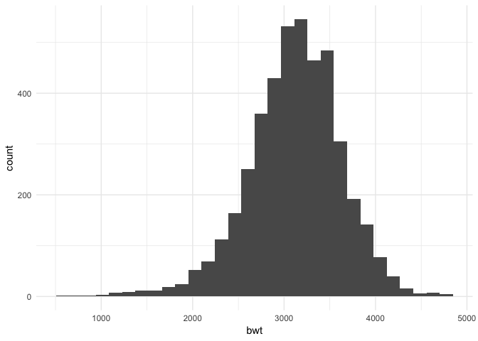
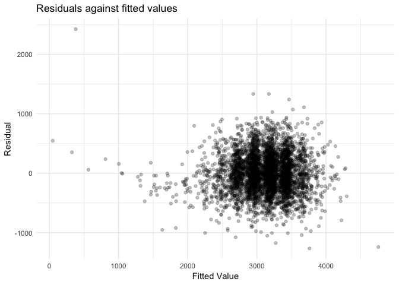
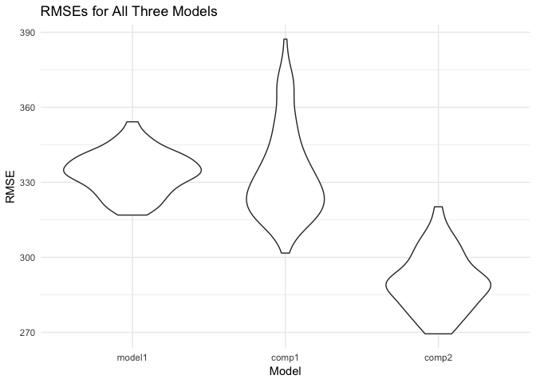

P8105 HW 6
================
Grace Liu
11/27/2018

P8105 Homework 6
----------------

### Problem 1

``` r
# Create a city_state variable (e.g. “Baltimore, MD”), and a binary variable indicating whether the homicide is solved. Omit cities Dallas, TX; Phoenix, AZ; and Kansas City, MO – these don’t report victim race. Also omit Tulsa, AL – this is a data entry mistake. Modifiy victim_race to have categories white and non-white, with white as the reference category. Be sure that victim_age is numeric.

homicides = 
  read_csv("https://raw.githubusercontent.com/washingtonpost/data-homicides/master/homicide-data.csv") %>% 
  mutate(city_state = paste(city, state, sep = ", "),
         victim_race = ifelse(victim_race != "White", "Non-White", "White"),
         resolved = ifelse(disposition == "Closed by arrest", 1, 0),
         victim_race = fct_relevel(victim_race, "White")) %>% 
  transform(reported_date = as.Date(as.character(reported_date), "%Y%m%d"), 
            victim_age = as.numeric(victim_age)) %>% 
  select(uid, reported_date, city_state, everything()) %>% 
  select(-city, -state) %>% 
  filter(!city_state %in% c("Tulsa, AL", "Dallas, TX", "Phoenix, AZ", "Kansas City, MO")) %>% 
  janitor::clean_names()
```

    ## Parsed with column specification:
    ## cols(
    ##   uid = col_character(),
    ##   reported_date = col_integer(),
    ##   victim_last = col_character(),
    ##   victim_first = col_character(),
    ##   victim_race = col_character(),
    ##   victim_age = col_character(),
    ##   victim_sex = col_character(),
    ##   city = col_character(),
    ##   state = col_character(),
    ##   lat = col_double(),
    ##   lon = col_double(),
    ##   disposition = col_character()
    ## )

    ## Warning in eval(substitute(list(...)), `_data`, parent.frame()): NAs
    ## introduced by coercion

``` r
# For the city of Baltimore, MD, use the glm function to fit a logistic regression with resolved vs unresolved as the outcome and victim age, sex and race (as just defined) as predictors. Save the output of glm as an R object; apply the broom::tidy to this object; and obtain the estimate and confidence interval of the adjusted odds ratio for solving homicides comparing non-white victims to white victims keeping all other variables fixed.

hom_baltimore = homicides %>% 
  filter(city_state == "Baltimore, MD")

fit_baltimore = hom_baltimore%>% 
  glm(resolved ~ victim_age + victim_sex + victim_race, data = ., family = binomial()) 

fit_baltimore %>% 
  broom::tidy() %>% 
  mutate(OR = exp(estimate),
         OR_lower = exp(estimate - 1.96*std.error),
         OR_upper = exp(estimate + 1.96*std.error)) %>%
  select(term, log_OR = estimate, OR, OR_upper, OR_lower, p.value) %>% 
  knitr::kable(digits = 3)
```

| term                  |  log\_OR|     OR|  OR\_upper|  OR\_lower|  p.value|
|:----------------------|--------:|------:|----------:|----------:|--------:|
| (Intercept)           |    1.186|  3.274|      5.186|      2.067|    0.000|
| victim\_age           |   -0.007|  0.993|      0.999|      0.987|    0.032|
| victim\_sexMale       |   -0.888|  0.412|      0.537|      0.315|    0.000|
| victim\_raceNon-White |   -0.820|  0.441|      0.620|      0.313|    0.000|

Homicides in which the victim is non-white are far less likely to be resolved compared to homicides where the victim is white. In cases with non-white victims, the odds of solving the homicide are 0.441 times that of cases with white victims (95% CI: 0.315, 0.620).

``` r
# Now run glm for each of the cities in your dataset, and extract the adjusted odds ratio (and CI) for solving homicides comparing non-white victims to white victims. Do this within a “tidy” pipeline, making use of purrr::map, list columns, and unnest as necessary to create a dataframe with estimated ORs and CIs for each city.

hom_allcities = homicides %>%
  group_by(city_state) %>% 
  nest() %>% 
  mutate(models = map(data, ~glm(resolved ~ victim_age + victim_sex + victim_race, data = ., family = binomial())),
         models = map(models, broom::tidy)) %>% 
  select(-data) %>% 
  unnest() %>%
  filter(term == "victim_raceNon-White") %>% 
  mutate(OR = exp(estimate),
         OR_lower = exp(estimate - 1.96*std.error),
         OR_upper = exp(estimate + 1.96*std.error)) %>%
  select(city_state, log_OR = estimate, OR, OR_upper, OR_lower, p.value) %>% 
  mutate(p.value = round(p.value, digits = 4))
```

``` r
# Create a plot that shows the estimated ORs and CIs for each city. Organize cities according to estimated OR, and comment on the plot.

hom_allcities %>% 
  ggplot(aes(x = city_state, y = OR)) +
  geom_point(color = "cornflowerblue", size = 1) +
    geom_errorbar(aes(ymin = OR_lower, ymax = OR_upper), color = "cornflowerblue", alpha = 0.5) +
    labs(x = "City", y = "OR", 
         title = "Odds ratio of homicides solved, comparing white to non-white victims, by city",
         subtitle = "ORs with 95% Confidence Intervals") +
    theme(axis.text.x = element_text(angle = 90, size = 7.5))
```


Boston, MA, has the lowest OR of all cities in the dataset. With an OR of 0.11 (95% CI: 0.05, 0.28), this indicates that, in Boston, MA, the odds of solving a homicide with a non-white victim are 0.11 times that of solving a homicide with a white victim, controlling for sex and age.

On the contrary, Tampa, FL, has the lowest OR of all cities in the dataset \[OR: 1.16 (95% CI: 0.59, 2.29)\]. In Tampa, FL, controlling for sex and age, the odds of solving a homicide with a non-white victim are 0.11 times that of solving a homicide with a white victim.

Of the 47 cities in the dataset, there are 26 cities where the p-value is &lt; 0.05. This means that the OR for solving homicides comparing non-white victims to white victims is statistically significant and appreciably different than the null value of OR = 1.

### Problem 2

``` r
# Load and clean the data for regression analysis (i.e. convert numeric to factor where appropriate, check for missing data, etc.).

birthweight = 
  read_csv("http://p8105.com/data/birthweight.csv") %>% 
  janitor::clean_names() %>% 
  mutate(babysex = as.factor(babysex), 
         malform = as.factor(malform),
         frace = as.factor(frace), 
         mrace = as.factor(mrace))
```

    ## Parsed with column specification:
    ## cols(
    ##   .default = col_integer(),
    ##   gaweeks = col_double(),
    ##   ppbmi = col_double(),
    ##   smoken = col_double()
    ## )

    ## See spec(...) for full column specifications.

``` r
birthweight %>% 
  ggplot(aes(x = bwt)) + 
  geom_histogram()
```

    ## `stat_bin()` using `bins = 30`. Pick better value with `binwidth`.



Birthweight appears to be relatively normally distributed.

``` r
# Propose a regression model for birthweight. This model may be based on a hypothesized structure for the factors that underly birthweight, on a data-driven model-building process, or a combination of the two. Describe your modeling process and show a plot of model residuals against fitted values – use add_predictions and add_residuals in making this plot.

model1 = lm(bwt ~ babysex + momage + wtgain + bhead, data = birthweight)
model2 = lm(bwt ~ babysex + mrace, data = birthweight)
model3 = lm(bwt ~ babysex + gaweeks + bhead + blength, data = birthweight)

summary(model1) # Chose this model as it was of the most clinical interest.
```

    ## 
    ## Call:
    ## lm(formula = bwt ~ babysex + momage + wtgain + bhead, data = birthweight)
    ## 
    ## Residuals:
    ##      Min       1Q   Median       3Q      Max 
    ## -1265.16  -225.87   -12.23   219.57  2425.32 
    ## 
    ## Coefficients:
    ##              Estimate Std. Error t value Pr(>|t|)    
    ## (Intercept) -4922.517    109.007 -45.158  < 2e-16 ***
    ## babysex2       43.087     10.266   4.197 2.76e-05 ***
    ## momage          9.225      1.320   6.987 3.23e-12 ***
    ## wtgain          5.708      0.473  12.068  < 2e-16 ***
    ## bhead         228.900      3.243  70.576  < 2e-16 ***
    ## ---
    ## Signif. codes:  0 '***' 0.001 '**' 0.01 '*' 0.05 '.' 0.1 ' ' 1
    ## 
    ## Residual standard error: 333.2 on 4337 degrees of freedom
    ## Multiple R-squared:  0.5771, Adjusted R-squared:  0.5767 
    ## F-statistic:  1480 on 4 and 4337 DF,  p-value: < 2.2e-16

``` r
birthweight %>% 
  add_predictions(model1) %>%
  add_residuals(model1) %>%
  ggplot(aes(y = resid, x = pred)) + 
  geom_point(alpha = 0.25) +
  labs(x = "Fitted Value",
       y = "Residual",
       title = "Residuals against fitted values")
```



I chose to model baby's sex, mom's age (at deliver), mom's weight gain during pregnancy, and baby's head circumference as predictors of baby's birthweight. Mother's age at delivery and weight gain during pregnancy have both been shown to be factors associated with premature birth and low birthweight babies, so I felt it was fitting that they may also be associated with overall infant birthweight. Head circumference is often closely associated with gestational age as well as fetal growth, so I also hypothesized that this may influence birthweight. Finally, I included baby's sex in all my initially proposed models in order to control for weight differences due to sex.

``` r
# Compare your model to two others:
# One using length at birth and gestational age as predictors (main effects only)
compare1 = lm(bwt ~ blength + gaweeks, data = birthweight)
summary(compare1)
```

    ## 
    ## Call:
    ## lm(formula = bwt ~ blength + gaweeks, data = birthweight)
    ## 
    ## Residuals:
    ##     Min      1Q  Median      3Q     Max 
    ## -1709.6  -215.4   -11.4   208.2  4188.8 
    ## 
    ## Coefficients:
    ##              Estimate Std. Error t value Pr(>|t|)    
    ## (Intercept) -4347.667     97.958  -44.38   <2e-16 ***
    ## blength       128.556      1.990   64.60   <2e-16 ***
    ## gaweeks        27.047      1.718   15.74   <2e-16 ***
    ## ---
    ## Signif. codes:  0 '***' 0.001 '**' 0.01 '*' 0.05 '.' 0.1 ' ' 1
    ## 
    ## Residual standard error: 333.2 on 4339 degrees of freedom
    ## Multiple R-squared:  0.5769, Adjusted R-squared:  0.5767 
    ## F-statistic:  2958 on 2 and 4339 DF,  p-value: < 2.2e-16

``` r
# One using head circumference, length, sex, and all interactions (including the three-way interaction) between these
compare2 = lm(bwt ~ bhead + blength + babysex + 
                        bhead*blength + blength*babysex + bhead*babysex + bhead*blength*babysex, data = birthweight)
summary(compare2)
```

    ## 
    ## Call:
    ## lm(formula = bwt ~ bhead + blength + babysex + bhead * blength + 
    ##     blength * babysex + bhead * babysex + bhead * blength * babysex, 
    ##     data = birthweight)
    ## 
    ## Residuals:
    ##      Min       1Q   Median       3Q      Max 
    ## -1132.99  -190.42   -10.33   178.63  2617.96 
    ## 
    ## Coefficients:
    ##                          Estimate Std. Error t value Pr(>|t|)    
    ## (Intercept)            -7176.8170  1264.8397  -5.674 1.49e-08 ***
    ## bhead                    181.7956    38.0542   4.777 1.84e-06 ***
    ## blength                  102.1269    26.2118   3.896 9.92e-05 ***
    ## babysex2                6374.8684  1677.7669   3.800 0.000147 ***
    ## bhead:blength             -0.5536     0.7802  -0.710 0.478012    
    ## blength:babysex2        -123.7729    35.1185  -3.524 0.000429 ***
    ## bhead:babysex2          -198.3932    51.0917  -3.883 0.000105 ***
    ## bhead:blength:babysex2     3.8781     1.0566   3.670 0.000245 ***
    ## ---
    ## Signif. codes:  0 '***' 0.001 '**' 0.01 '*' 0.05 '.' 0.1 ' ' 1
    ## 
    ## Residual standard error: 287.7 on 4334 degrees of freedom
    ## Multiple R-squared:  0.6849, Adjusted R-squared:  0.6844 
    ## F-statistic:  1346 on 7 and 4334 DF,  p-value: < 2.2e-16

``` r
# Make this comparison in terms of the cross-validated prediction error; use crossv_mc and functions in purrr as appropriate.
bwt_crossv = crossv_mc(birthweight, 100) %>% 
    mutate(train = map(train, as_tibble),
           test  = map(test, as_tibble))

bwt_crossv2 =
bwt_crossv %>% 
  mutate(model1 = map(train, ~lm(bwt ~ babysex + momage + wtgain + bhead, data = .x)),
         comp1 = map(train, ~lm(bwt ~ blength + gaweeks, data = .x)),
         comp2 = map(train, ~lm(bwt ~ bhead + blength + babysex + 
                        bhead*blength + blength*babysex + bhead*babysex + bhead*blength*babysex, data = .x))
         ) %>% 
  mutate(rmse_model1  = map2_dbl(model1,  test, ~rmse(model = .x, data = .y)),
         rmse_comp1 = map2_dbl(comp1, test, ~rmse(model = .x, data = .y)),
         rmse_comp2 = map2_dbl(comp2, test, ~rmse(model = .x, data = .y))
         )

bwt_crossv2 %>% 
  select(starts_with("rmse")) %>% 
  gather(key = model, value = rmse) %>% 
  mutate(model = str_replace(model, "rmse_", ""),
         model = fct_inorder(model)) %>% 
  ggplot(aes(x = model, y = rmse)) + 
    geom_violin()  +
  labs(x = "Model",
       y = "RMSE",
       title = "RMSEs for All Three Models")
```



In comparing my model to the two comparison models, I would chose the Comparison Model 2 that includes head circumference, length, sex, and all interactions (including the three-way interaction). My model was close to Comparison Model 1, but I think my model could have benefited from some interaction terms.
